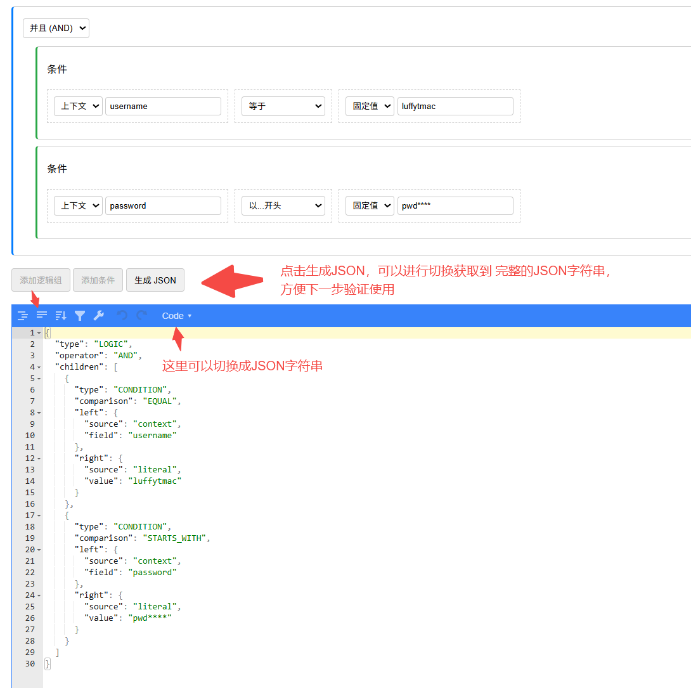

# parse-expression
包含的主要功能：设置表达式|解析表达式

# 配置表达式
项目启动后，访问 http://localhost:9001/editor11
1. 可以配置上下文中的变量
2. 可以配置数据库的相关字段

3. 点击生成json按钮

# 提交验证表达式
将配置的表达式的json字符串和上下文map一起提交，验证表达式是否正确 
项目启动后，POST方式提交到 http://localhost:9001/validate

# 下面是一些程序的截图

# 溫馨提示：
    1. 如果表达式里面配置了数据库相关的字段，那么我们就需要去完善EventType里面定义的枚举，再根据我们的策略类去做每张表的查询动作，
    因为我们查询每张表的条件可能会不一样，用到的查询字段也可能会不一样，这个就要具体问题具体分析；
    2. 表达式里面可以配置两个数值的差值比较，比如：表达式左右两边的数值之差与某个特定的值进行比较；
    3. 表达式里面可以配置两个日期的比较，其中细分：年相等、月相等、日相等、年差值、月差值、日差值
    4. 如果要用数据库进行认证判断，需要引入数据库相关的依赖，并且需要将数据表和EventType枚举进行关联
